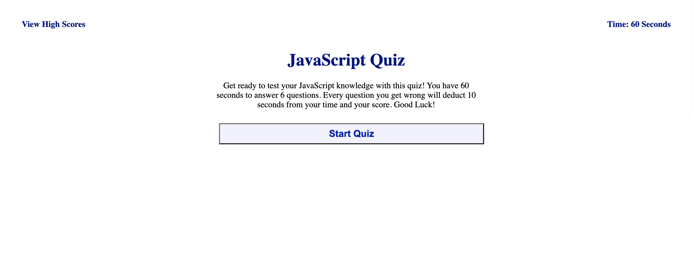
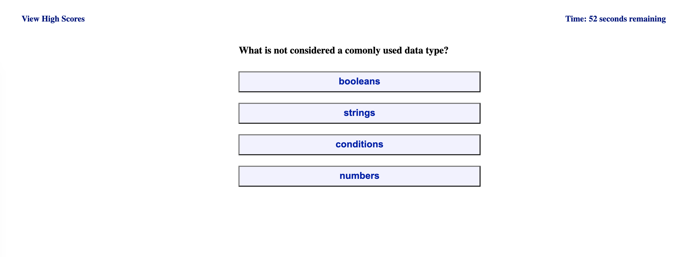
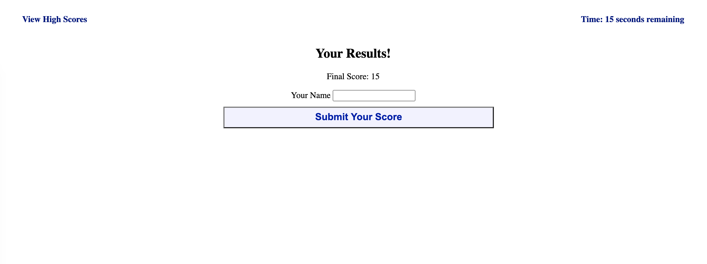
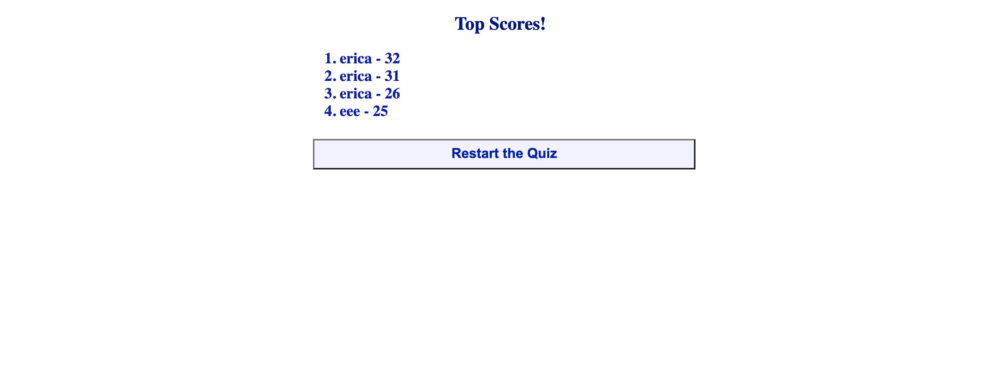

# JavaScript Quiz

## Goal
Object is to create a timed javaScript quiz. The user will have 60 seconds to answer a series of multiple choice questions. If the user gets the question wrong, they will have 10 seconds deducted from their time. At the end of the quiz, the remaining time will be the user's score. The user will then have the ability to submit their score and store it in the "Top Scores" tab. 

 Once the user presses the "Start Quiz" button, the quiz will begin and a timer will start to count down. 

 The user will pick an answer choice and the next question will initiate. They will also be infomed if they a "Correct Answer" or "Wrong Answer"

 If the answer is wrong, 10 seconds will be deducted from their time

The time is considered their "score"

At the end of the quiz the user will have the option to submit their score to the local storage. 

The user can view high scores in the Top Scores tab.

If the user would like to try for a harder score, they can take the quiz again.

### [Click Here](https://ericasiegel.github.io/javaScript-quiz/) to see the app.

### Begining of Quiz

### Quiz

### Final Score

### High Scores

